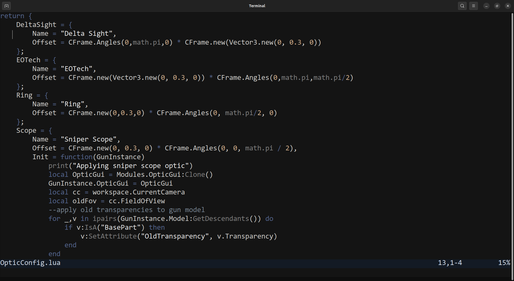

monochrome.nvim
===

Theme preview:


Monochrome neovim theme made with `lush.nvim`. Easy on the eyes.

Make sure to run `:set termguicolors` for the theme to work.

Install with packer:
```lua
use "GabeeCoding/monochrome.nvim"
```
